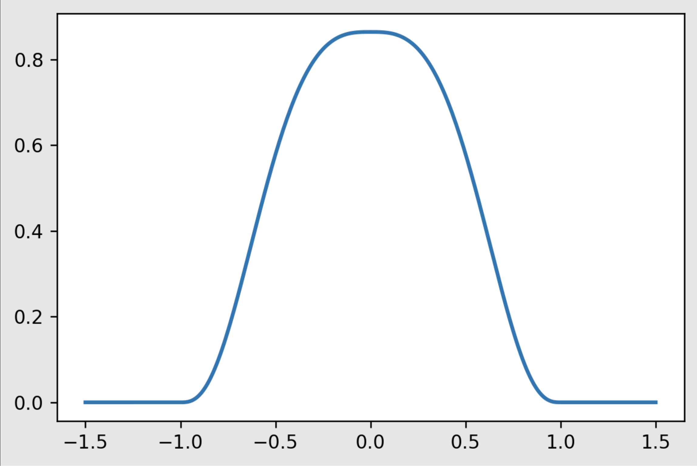
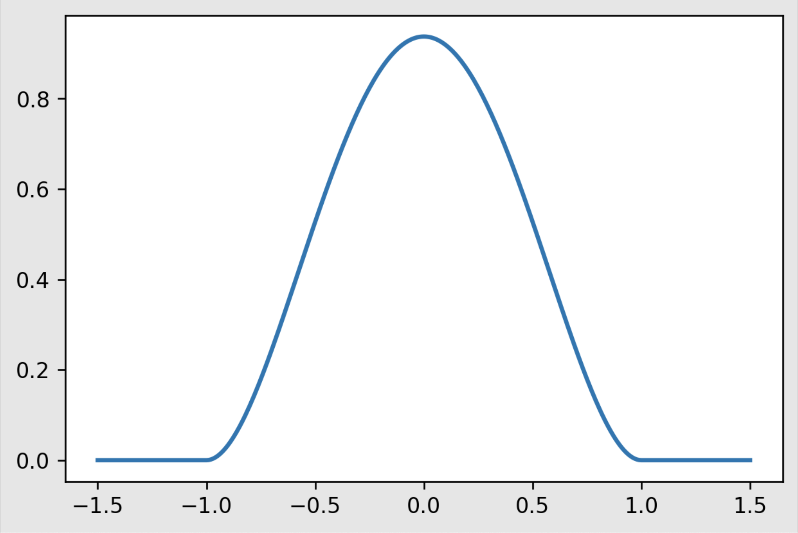
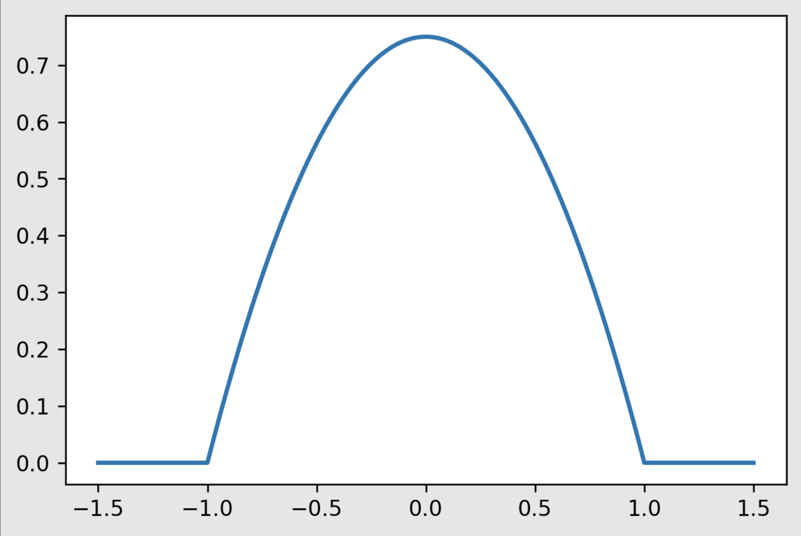

# Comparison of Lowess and Random Forest


## Lowess (locally weighted scatterplot smoothing)
#### Lowess is a way of fitting a curve to data. It is a non-parametric approach because the data is not assumed to fit a type of distribution, so it can model non linear data. It uses a sliding window approach to split the data into sections. Then in each section performs a regression by minimizing least squares. The kernel function is used to determine the weight of influence a point has in relation to the focal point, and is part of the sliding window process. It can be adjusted by manipulating the kernel function. Additionally the tau hyperparameter is used to decide the span of the kernel, and therefore the number of points considered in each regression performed. A larger tau will make the regression follow the overall trend, whereas a smaller tau will make the regression more sensitive to each given point.


## Lowess Kernels

The kernels are used to define the weight of importance associated with a given point (relative to the focal point), when performing the regressions.

Tricubic



Quartic



Epanechnikov



Here is their python implementations:

```Python

# Tricubic Kernel
def Tricubic(x):
    return np.where(np.abs(x)>1,0,70/81*(1-np.abs(x)**3)**3)

# Epanechnikov Kernel
def Epanechnikov(x):
    return np.where(np.abs(x)>1,0,3/4*(1-np.abs(x)**2)) 
    
# Quartic Kernel
def Quartic(x):
    return np.where(np.abs(x)>1,0,15/16*(1-np.abs(x)**2)**2) 

```

----