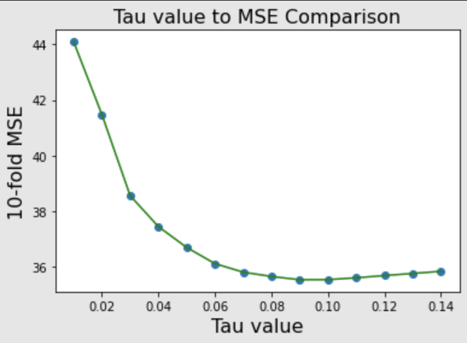
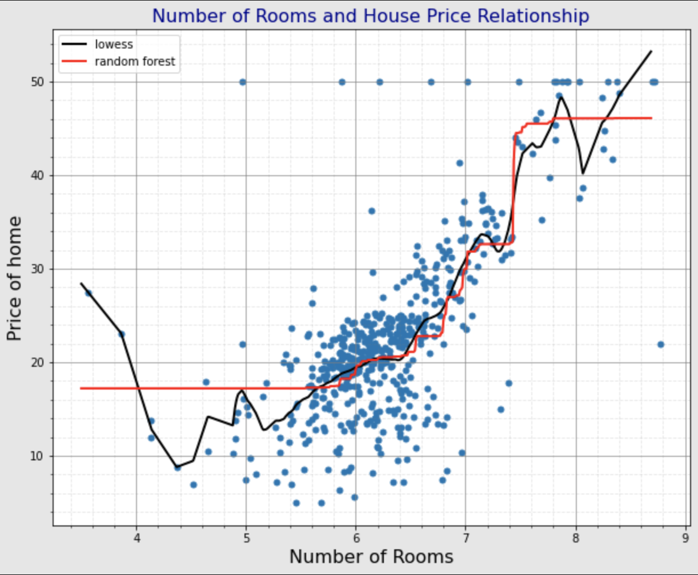

# Comparison of LOWESS and Random Forest - Regression Models


## Lowess (locally weighted scatterplot smoothing)
#### Lowess is a way of fitting a curve to data. It is a non-parametric approach because the data is not assumed to fit a type of distribution, so it can model non linear data. It uses a sliding window approach to split the data into sections. Then in each section performs a regression by minimizing least squares. The kernel function is used to determine the weight of influence a point has in relation to the focal point, and is part of the sliding window process. It can be adjusted by manipulating the kernel function. Additionally the tau hyperparameter is used to decide the span of the kernel, and therefore the number of points considered in each regression performed. A larger tau will make the regression follow the overall trend, whereas a smaller tau will make the regression more sensitive to each given point.


## Lowess Kernels

The kernels are used to define the weight of importance associated with a given point (relative to the focal point), when performing the regressions.

Tricubic


Quartic


Epanechnikov


Here are their python implementations:

```Python
# Tricubic Kernel
def Tricubic(x):
    return np.where(np.abs(x)>1,0,70/81*(1-np.abs(x)**3)**3)

# Epanechnikov Kernel
def Epanechnikov(x):
    return np.where(np.abs(x)>1,0,3/4*(1-np.abs(x)**2)) 

# Quartic Kernel
def Quartic(x):
    return np.where(np.abs(x)>1,0,15/16*(1-np.abs(x)**2)**2) 
```

## Our Lowess Implementation
scikitlearn does not implement lowess, so we program our own.
```Python
# define our local regression function
# x, y - training data
# xnew - testing data
# kern - kernel
# tau - hyperparameter
def lowess_reg(x, y, xnew, kern, tau):
    # tau is called bandwidth K((x-x[i])/(2*tau))
    # IMPORTANT: we expect x to the sorted increasingly
    n = len(x)
    yest = np.zeros(n)

    #Initializing all weights from the bell shape kernel function    
    w = np.array([kern((x - x[i])/(2*tau)) for i in range(n)])     
    
    #Looping through all x-points
    for i in range(n):
        weights = w[:, i]
        b = np.array([np.sum(weights * y), np.sum(weights * y * x)])
        A = np.array([[np.sum(weights), np.sum(weights * x)],
                    [np.sum(weights * x), np.sum(weights * x * x)]])
        #theta = linalg.solve(A, b) # A*theta = b
        theta, res, rnk, s = linalg.lstsq(A, b)
        yest[i] = theta[0] + theta[1] * x[i] 
    f = interp1d(x, yest, fill_value='extrapolate')
    return f(xnew)
```


----
## Random Forest

#### Random forest is based on using a collection of decision trees. A decision tree splits datapoints into groups recursively using decision nodes. It finds the best split by maximizing the entropy gain. Random forest is a collection of random decision trees. It starts by picking a number of data points from the training set. Then builds a decision tree with these data points. The number of points and trees are controlled by hyperparameters, n_estimators and max_depth. Then using these trees, predict the value for a given point, and assign the new point as the average of the predictions. This also makes random forest effective at modeling non-linear relationships.

## Our Random Forest Implementation

We can use the sklearn model for our purposes, rather than crafting our own.
```Python
from sklearn.ensemble import RandomForestRegressor
```

---

# Dataset 1: Cars

This dataset includes a number of measurements regarding motor cars. In particular, we will look at the relationship between the weight of the cars (in lbs) and the miles per gallon (mpg). The goal is to design a model that can most accurately predict the mpg of a car, given the weight in lbs.


One way to craft a model is to minimize the mean squared error (MSE). To do this, we can iterate over our types of kernels, and a range of possible tau values. For each of these we will build a model, and then perform a k-fold validation to determine the MSE. Keep in mind, this process can take a while because lowess is computationally heavy compared to standard regression models.

```Python
X = data['WGT'].values
y = data['MPG'].values
scale = StandardScaler()

lowest_mse = 9999
fav_kern = "unknown"
fav_tau = 0
kf = KFold(n_splits=10,shuffle=True,random_state=1234)
for kern in [Tricubic, Epanechnikov, Quartic]:
    for tau in [i/1000 for i in range(1, 10000, 250)]:
        # reset mse list for each kfold validation
        mse_lwr = []
        for idxtrain,idxtest in kf.split(X):
            # perform data handling scaling
            ytrain = y[idxtrain]
            xtrain = X[idxtrain]
            xtrain = scale.fit_transform(xtrain.reshape(-1,1))
            ytest = y[idxtest]
            xtest = X[idxtest]
            xtest = scale.transform(xtest.reshape(-1,1))
            # use lowess to make predictions using this fold of data
            yhat_lwr = lowess_reg(xtrain.ravel(), ytrain, xtest.ravel(), kern, tau)
            mse_lwr.append(mse(ytest,yhat_lwr))  
        if np.mean(mse_lwr) < lowest_mse:
            lowest_mse = np.mean(mse_lwr)
            fav_kern = kern
            fav_tau = tau
print(lowest_mse, fav_kern, fav_tau)
```

Similarly, we can approach finding the lowest MSE of a random forest model like so.

```Python
lowest_mse = 9999
fav_depth = 0
fav_n = 0

kf = KFold(n_splits=10, shuffle=True, random_state=1234)
for depth in range(1,10):
    for n in range(5, 255, 5):
        rf = RandomForestRegressor(n_estimators=n, max_depth=depth)
        mse_rf = []
        for idxtrain,idxtest in kf.split(X):
            # perform data handling scaling
            ytrain = y[idxtrain]
            xtrain = X[idxtrain]
            xtrain = scale.fit_transform(xtrain.reshape(-1,1))
            ytest = y[idxtest]
            xtest = X[idxtest]
            xtest = scale.transform(xtest.reshape(-1,1))
            # use rf to make predictions using this fold of data
            rf.fit(xtrain,ytrain)
            yhat_rf = rf.predict(xtest)
            mse_rf.append(mse(ytest,yhat_rf))
        if np.mean(mse_rf) < lowest_mse:
            lowest_mse = np.mean(mse_rf)
            fav_depth = depth
            fav_n = n
print(lowest_mse, fav_depth, fav_n)
```

We find the following:

Lowess: Epanechnikov kernel and 0.387 tau results in a cross validated MSE: ~17.486

RF:  60 n_estimators and 3 max_depth results in a cross validated MSE: ~17.489

Here is our best models compared visually. The black line shows the lowess model, while the red line shows random forest.


---

# Dateset 2: Boston Housing Prices

First step is to optimize the tau values for each kernel function and find the best k-fold validated mean square error. This is what we will use to compare against a random forest model.

This time, instead of combining this process into one script, I have seperated and graphed the k-fold validated mean square errors for the different tau values for each kernel. I think this will help illustrate how tau value adjustments effect the model.


MSE: ~35.521 Tau: 0.1



MSE: ~35.532 Tau: 0.09


MSE: ~35.492 Tau: 0.085


Given these results, we will use a Epanechnikov kernel with a tau of 0.085.

Here is the python code that was used for calculating and plotting the optimal values. (similar code was repeated for each kernel)

```Python
mse_total_list = []
tau_total_list = []

lowest_mse = 9999
fav_tau = 0

for tau in [i/1000 for i in range(10, 150, 10)]:
    # reset mse list for each kfold validation
    mse_lwr = []

    for idxtrain,idxtest in kf.split(X):

        # perform data handling scaling
        ytrain = y[idxtrain]
        xtrain = X[idxtrain]
        xtrain = scale.fit_transform(xtrain.values.reshape(-1,1))
        ytest = y[idxtest]
        xtest = X[idxtest]
        xtest = scale.transform(xtest.values.reshape(-1,1))
        # use lowess to make predictions using this fold of data
        yhat_lwr = lowess_reg(xtrain.ravel(), ytrain, xtest.ravel(), Tricubic, tau)
        mse_lwr.append(mse(ytest,yhat_lwr))

    mse_total_list.append(np.mean(mse_lwr))
    tau_total_list.append(tau)
    
    if np.mean(mse_lwr) < lowest_mse:
        lowest_mse = np.mean(mse_lwr)
        fav_tau = tau

plt.xlabel("Tau value",fontsize=16,color='Black')
plt.ylabel('10-fold MSE',fontsize=16,color='Black')
plt.title("Tau value to MSE Comparison",fontsize=16)
plt.scatter(tau_total_list, mse_total_list)
plt.plot(tau_total_list, mse_total_list)

print("Tricubic", lowest_mse, fav_tau)
```

To calculate the optimal values for random forest, I iterated through possible depths and estimators to find the best k-fold validated mean square error. The code is shown below.

```Python
X = data["rooms"]
y = data['cmedv']
scale = StandardScaler()

lowest_mse = 9999
fav_depth = 0
fav_n = 0

kf = KFold(n_splits=10, shuffle=True, random_state=1234)

for depth in range(1,10):
    for n in range(5, 151, 5):

        rf = RandomForestRegressor(n_estimators=n, max_depth=depth)
        mse_rf = []

        for idxtrain,idxtest in kf.split(X):
            
            # perform data handling scaling
            ytrain = y[idxtrain]
            xtrain = X[idxtrain]
            xtrain = scale.fit_transform(xtrain.values.reshape(-1,1))
            ytest = y[idxtest]
            xtest = X[idxtest]
            xtest = scale.transform(xtest.values.reshape(-1,1))

            # use rf to make predictions using this fold of data
            rf.fit(xtrain,ytrain)
            yhat_rf = rf.predict(xtest)
            mse_rf.append(mse(ytest,yhat_rf))

            if np.mean(mse_rf) < lowest_mse:
                lowest_mse = np.mean(mse_rf)
                fav_depth = depth
                fav_n = n

print(lowest_mse, fav_depth, fav_n)
```

MSE: ~35.510 n_estimators: 150, max_depth: 2

## Comparing Lowess and Random Forest Graphically

We find the following:

Lowess: Epanechnikov kernel and 0.085 tau results in a cross validated MSE: ~35.492

RF: 150 n_estimators and 2 max_depth results in a cross validated MSE: ~35.510

Here is our best models compared visually. The black line shows the lowess model, while the red line shows random forest.



---
## Conclusions

Best Models for Cars Data:

Lowess: ~**17.486** MSE

Random Forest: ~17.489 MSE

Best Models for Boston Housing Data:

Lowess: ~**35.492** MSE

Random Forest: ~35.510 MSE

Ultimately, the models are comparable in their effectiveness for modeling the given data in both cases. That said, the lowess approach with an Epanechnikov kernel was marginally more effective for both the cars mpg prediction and the boston house price prediction. Notably, the random forest showed a better looking trend line when graphed, but was not as accurate. The lowess model is very versatile given its ability to flex to the given data.

## Overall Winner: Lowess Model