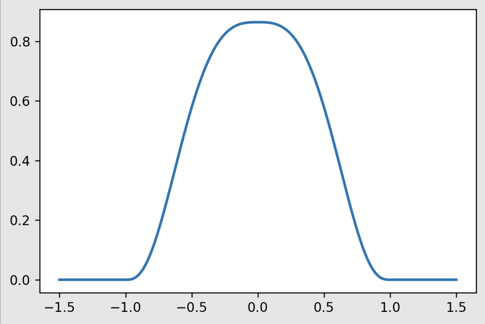
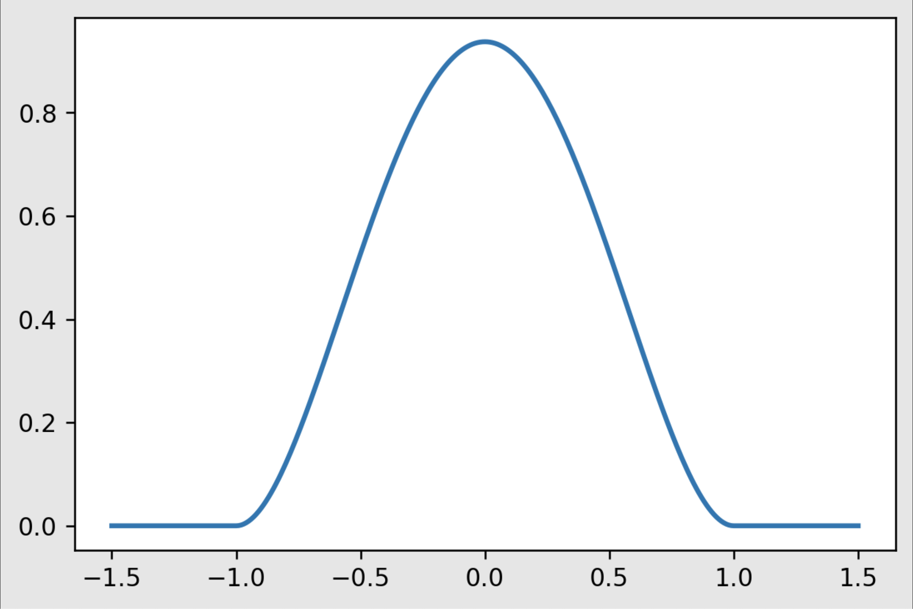

# Multivariate Regression, Gradient Boosting, XGBoost

## Multivariate Regression Analysis
Multivariate regression models deal with more than a single predictor for a dependent variable.

The mathematical equation is as follows:
$$ y=\beta_{0}+\beta_{1} \cdot x_{1}+\ldots+\beta_{n} \cdot x_{n} $$

## Boosting
Boosting is a form of ensemble learning where a strong learner is created from weak learners.To achieve this, two types of ensemble learning can be used: bagging or boosting. Bagging is done in parallel whereas boosting is done sequentially. A bagging strategy will divide up the dataset and train a number of different weak learners, then combine them all to produce a stronger learner. This is different from boosting where the weak learners are created during the training phase where the model is fed the data. Then increased weights are added to the misclassified data points, so that the model can improve on the next iteration - ideally this repeats until all points are classified correctly. 


The diagram above helps visualize the difference between the types of ensemble methods.


## Types of Boosting

### Adaptive Boosting
Adaptive boosting works by drawing a ‘decision stump’ where a basic machine learning method is applied to the dataset. Then the data weights are updated and the model draws a new decision stump, the result of which becomes incorporated into the overall model. The idea being that the model learns from its misclassifications. Here is a diagram that shows how the model repeatedly and iteratively uses a decision tree to improve its performance.


Can be used in classification and regression, but typically applied to classification problems.

## Gradient Boosting

Also based on the sequential ensemble model. It works by generating base learners sequentially that are better than the previous one. However, it does not adjust the weight of misclassified data points, it focuses on optimizing the loss function of the previous model by adding an adaptive model that adds weak learners. 
- Loss function
- Weak learners for forming strong learners 
- Additive model that regularizes loss function

## Extreme Gradient Boosting (XGBoost)

To further delve into our exploration I have added a few additional kernel functions, Triangular and Cosine. Here is how they look visually, as well as the accompanying python code.

Tricubic



Quartic



Epanechnikov


Triangular


Cosine 


# Model Definitions

For this project, we will compare 4 types of regression models. 
- LOWESS
- Boosted LOWESS
- Random Forest
- XGBoost

LOWESS Definiton
```Python
def lw_reg(X, y, xnew, kern, tau, intercept):
    # tau is called bandwidth K((x-x[i])/(2*tau))
    n = len(X) # the number of observations
    yest = np.zeros(n)

    if len(y.shape)==1: # here we make column vectors
      y = y.reshape(-1,1)

    if len(X.shape)==1:
      X = X.reshape(-1,1)
    
    if intercept:
      X1 = np.column_stack([np.ones((len(X),1)),X])
    else:
      X1 = X

    w = np.array([kern((X - X[i])/(2*tau)) for i in range(n)]) # here we compute n vectors of weights

    #Looping through all X-points
    for i in range(n):          
        W = np.diag(w[:,i])
        b = np.transpose(X1).dot(W).dot(y)
        A = np.transpose(X1).dot(W).dot(X1)
        #A = A + 0.001*np.eye(X1.shape[1]) # if we want L2 regularization
        #theta = linalg.solve(A, b) # A*theta = b
        beta, res, rnk, s = lstsq(A, b)
        yest[i] = np.dot(X1[i],beta)
    if X.shape[1]==1:
      f = interp1d(X.flatten(),yest,fill_value='extrapolate')
    else:
      f = LinearNDInterpolator(X, yest)
    output = f(xnew) # the output may have NaN's where the data points from xnew are outside the convex hull of X
    if sum(np.isnan(output))>0:
      g = NearestNDInterpolator(X,y.ravel()) 
      # output[np.isnan(output)] = g(X[np.isnan(output)])
      output[np.isnan(output)] = g(xnew[np.isnan(output)])
    return output
```

Boosted LOWESS Defition
```Python
def boosted_lwr(X, y, xnew, kern, tau, intercept):
  # we need decision trees
  # for training the boosted method we use X and y
  Fx = lw_reg(X,y,X,kern,tau,intercept) # we need this for training the Decision Tree
  # Now train the Decision Tree on y_i - F(x_i)
  new_y = y - Fx
  #model = DecisionTreeRegressor(max_depth=2, random_state=123)
  model = RandomForestRegressor(n_estimators=100,max_depth=2)
  #model = model_xgb
  model.fit(X,new_y)
  output = model.predict(xnew) + lw_reg(X,y,xnew,kern,tau,intercept)
  return output 
```

XGBoost
```Python
import xgboost as xgb
```

Random Forest Regression
```Python
from sklearn.ensemble import RandomForestRegressor
```

# Cars Dataset

The goal is to compare the forms of regression using the cars dataset and see their abilities at accurately predicting the miles per gallon of a vehicle. There are 3 independent variables in our dataset: number of cylinders, engine displacement, and weight of car. These are used to predict our dependent variable - miles per gallon. 

To start, we examine the locally weighted regression model. 

For each of these models, we use a process of iteratively checking hyperparameters and calculating their mean squared error.

```Python
mse_total_list = []
tau_total_list = []

lowest_mse = 9999
fav_tau = 0

for tau in [i/100 for i in range(10, 151, 10)]:
    # reset mse list for each kfold validation
    mse_lwr = []

    for idxtrain,idxtest in kf.split(X):

        # perform data handling scaling
        xtrain = X[idxtrain]
        ytrain = y[idxtrain]
        ytest = y[idxtest]
        xtest = X[idxtest]
        xtrain = scale.fit_transform(xtrain)
        xtest = scale.transform(xtest)
        # use lowess to make predictions using this fold of data
        yhat_lwr = lw_reg(xtrain, ytrain, xtest, Triangular, tau, intercept=True)
        mse_lwr.append(mse(ytest,yhat_lwr))

    mse_total_list.append(np.mean(mse_lwr))
    tau_total_list.append(tau)
    
    if np.mean(mse_lwr) < lowest_mse:
        lowest_mse = np.mean(mse_lwr)
        fav_tau = tau

plt.xlabel("Tau value",fontsize=16,color='Black')
plt.ylabel('10-fold MSE',fontsize=16,color='Black')
plt.title("Tau value to MSE Comparison",fontsize=16)
plt.scatter(tau_total_list, mse_total_list)
plt.plot(tau_total_list, mse_total_list, color='magenta')

print("Triangular", lowest_mse, fav_tau)
```
This code allows us to check for the best tau value for the locally weighted regression.


A similar approach was taken to optimize the hyperparameters for the other models.

```Python
lowest_mse = 9999
favs = []


kf = KFold(n_splits=10,shuffle=True,random_state=1234)
for est in range(40, 125, 10):
    for reg in range(0, 15, 2):
        for alph in range(0, 5, 1):
            for gam in range(0, 6, 1):
                for depth in range(1, 7, 1):
                    # reset mse list for each kfold validation
                    mse_xgb = []

                    for idxtrain,idxtest in kf.split(X):

                        # perform data handling scaling
                        xtrain = X[idxtrain]
                        ytrain = y[idxtrain]
                        ytest = y[idxtest]
                        xtest = X[idxtest]
                        xtrain = scale.fit_transform(xtrain)
                        xtest = scale.transform(xtest)
                        
                        # use lowess to make predictions using this fold of data
                        model_xgb = xgb.XGBRegressor(objective ='reg:squarederror',n_estimators=est,reg_lambda=reg,alpha=alph,gamma=gam,max_depth=depth)
                        model_xgb.fit(xtrain,ytrain)
                        yhat_xgb = model_xgb.predict(xtest)
                        
                        mse_xgb.append(mse(ytest,yhat_xgb))
                    
                    if np.mean(mse_xgb) < lowest_mse:
                        lowest_mse = np.mean(mse_xgb)
                        favs = [est, reg, alph, gam, depth]


print(lowest_mse)
print(favs)
```

Putting all of our models together, we can compare them using cross validated mean square error (MSE) and their mean absolute error (MAE). 

This is the code used to train and test all of the models on the dataset.

```Python
# we want more nested cross-validations

mse_lwr = []
mae_lwr = []

mse_blwr = []
mae_blwr = []

mse_rf = []
mae_rf = []

mse_xgb = []
mae_xgb = []

for i in range(5):
  kf = KFold(n_splits=10,shuffle=True,random_state=i)
  # this is the Cross-Validation Loop
  for idxtrain, idxtest in kf.split(X):
    # Data processing, splitting into train and test
    xtrain = X[idxtrain]
    ytrain = y[idxtrain]
    ytest = y[idxtest]
    xtest = X[idxtest]
    xtrain = scale.fit_transform(xtrain)
    xtest = scale.transform(xtest)
    
    # found Triangular with 0.5 
    yhat_lwr = lw_reg(xtrain,ytrain, xtest,Triangular,tau=0.12,intercept=True)

    # found Cosine with 0.9 
    yhat_blwr = boosted_lwr(xtrain,ytrain, xtest, Cosine, tau=0.9,intercept=True)
    
    # found 60 estimators with depth 3
    model_rf = RandomForestRegressor(n_estimators=60,max_depth=3)
    model_rf.fit(xtrain,ytrain)
    yhat_rf = model_rf.predict(xtest)
    
    model_xgb = xgb.XGBRegressor(objective ='reg:squarederror',n_estimators=60,reg_lambda=8,alpha=0,gamma=1,max_depth=2)
    model_xgb.fit(xtrain,ytrain)
    yhat_xgb = model_xgb.predict(xtest)
    
    # append the MSE and MAE to lists
    mse_lwr.append(mse(ytest,yhat_lwr))
    mae_lwr.append(MAE(ytest,yhat_lwr))
    mse_blwr.append(mse(ytest,yhat_blwr))
    mae_blwr.append(MAE(ytest,yhat_blwr))
    mse_rf.append(mse(ytest,yhat_rf))
    mae_rf.append(MAE(ytest,yhat_rf))
    mse_xgb.append(mse(ytest,yhat_xgb))
    mae_xgb.append(MAE(ytest,yhat_xgb))

print('The Cross-validated Mean Squared Error for LWR is :', round(np.mean(mse_lwr), 3), 'with Mean Absolute Error of:', round(np.mean(mae_lwr), 3))
print('The Cross-validated Mean Squared Error for BLWR is :', round(np.mean(mse_blwr), 3), 'with Mean Absolute Error of:', round(np.mean(mae_blwr), 3))
print('The Cross-validated Mean Squared Error for RF is :', round(np.mean(mse_rf), 3), 'with Mean Absolute Error of:', round(np.mean(mae_rf), 3))
print('The Cross-validated Mean Squared Error for XGB is :', round(np.mean(mse_xgb), 3), 'with Mean Absolute Error of:', round(np.mean(mae_xgb), 3))
```

### Results are:

| Model | Cross Validated MSE | Cross Validated MAE
| --- | ----------- | ----------- | 
| LWR | 17.934 | 3.059 |
| BLWR | 16.698 | 2.984 |
| LWR | 16.798 | 2.994 |
| XGBoost | 15.678 | 2.900 |


# Concrete Dataset

To find the bets kernel for LOWESS, I iterated through the kernels and some possible tau values.

```Python
lowest_mse = 9999
fav_kern = "unknown"
fav_tau = 0


kf = KFold(n_splits=10,shuffle=True,random_state=1234)
for kern in [Tricubic, Epanechnikov, Quartic, Triangular, Cosine]:
    for tau in [i/1000 for i in range(10, 150, 10)]:
        
        # reset mse list for each kfold validation
        mse_lwr = []

        for idxtrain,idxtest in kf.split(X):

            # perform data handling scaling
            xtrain = X[idxtrain]
            ytrain = y[idxtrain]
            ytest = y[idxtest]
            xtest = X[idxtest]
            xtrain = scale.fit_transform(xtrain)
            xtest = scale.transform(xtest)
            
            # use lowess to make predictions using this fold of data
            yhat_lwr = lw_reg(xtrain, ytrain, xtest, kern, tau, intercept=True)
            mse_lwr.append(mse(ytest,yhat_lwr))
        
        if np.mean(mse_lwr) < lowest_mse:
            lowest_mse = np.mean(mse_lwr)
            fav_kern = kern
            fav_tau = tau


print(lowest_mse, fav_kern, fav_tau)
```

Ultimately the best result was with the Triangular kernel. I decided to optimize the tau hyperparameter further. 

This code allows us to check for the best tau value for the locally weighted regression.

```Python
mse_total_list = []
tau_total_list = []

lowest_mse = 9999
fav_tau = 0

for tau in [i/100 for i in range(10, 151, 10)]:
    # reset mse list for each kfold validation
    mse_lwr = []

    for idxtrain,idxtest in kf.split(X):

        # perform data handling scaling
        xtrain = X[idxtrain]
        ytrain = y[idxtrain]
        ytest = y[idxtest]
        xtest = X[idxtest]
        xtrain = scale.fit_transform(xtrain)
        xtest = scale.transform(xtest)
        # use lowess to make predictions using this fold of data
        yhat_lwr = lw_reg(xtrain, ytrain, xtest, Triangular, tau, intercept=True)
        mse_lwr.append(mse(ytest,yhat_lwr))

    mse_total_list.append(np.mean(mse_lwr))
    tau_total_list.append(tau)
    
    if np.mean(mse_lwr) < lowest_mse:
        lowest_mse = np.mean(mse_lwr)
        fav_tau = tau

plt.xlabel("Tau value",fontsize=16,color='Black')
plt.ylabel('10-fold MSE',fontsize=16,color='Black')
plt.title("Tau value to MSE Comparison",fontsize=16)
plt.scatter(tau_total_list, mse_total_list)
plt.plot(tau_total_list, mse_total_list, color='blue')

print("Triangular", lowest_mse, fav_tau)
```

Which finds that the best MSE was with a tau value of 0.7


Similar approaches were used to optimize the hyperparameters for XGBoost, Random Forest, and Boosted LOWESS.


### Results are:

| Model | Cross Validated MSE | Cross Validated MAE
| --- | ----------- | ----------- | 
| LWR | 163.709 | 9.922 |
| BLWR | 142.708 | 9.627 |
| LWR | 162.002 | 10.454 |
| XGBoost | 142.432 | 9.615 |


# Conclusions


# Sources

- https://brilliant.org/wiki/multivariate-regression
- https://towardsdatascience.com/applied-multivariate-regression-faef8ddbf807