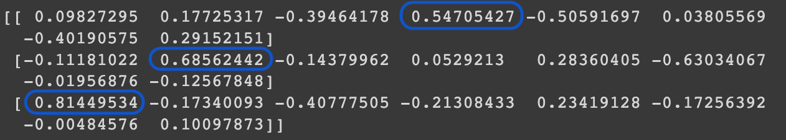
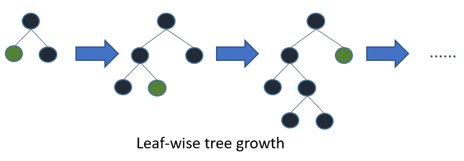
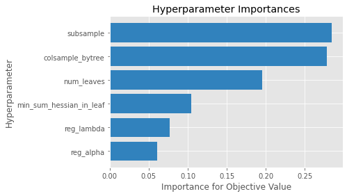

# Repeated Boosting & LGBM 

## Multiple Boosting on Concrete Dataset

### Data Processing
This data is slightly different, as it is stored in an excel file. Here is the data processing I performed to make it usable in google colab.

```Python
!pip install --upgrade xlrd
concrete = pd.read_excel('/content/drive/MyDrive/ML_410/Data/Concrete_Data.xls')
concrete.columns = ['Cement', 'Slag', 'Ash', 'Water', 'Superplasticizer', 'CoarseAgg', 'FineAggregate', 'Age', 'Strength']
X = concrete.iloc[:, :-1].values
y = concrete.iloc[:, -1].values
```


To start, we are cursed with too many dimensions. While it is possible to use all of the given data, we want to avoid rank deficiency. So we must find a way to reduce the dimensionality and limit our X predictor variables. One way to do this is using principle component analysis (PCA). 

```Python
pca = PCA(n_components=3)
# scale the data so that larger values do not appear to explain correlation more than others
scaled = scale.fit_transform(X)
pca.fit(scaled)
print(pca.components_)
```



With these results, we can see how strong of an indicator each independent variable is. Taking the largest 3, with the highest magnitudes (which can mean negative), we find that the best predictors are the cement, slag, and water content of the concrete. These factors will be used to build our multivariate regression model.

### Coding

```Python
def boosted_lwr(X, y, xnew, kern, tau, intercept, model_boosting, nboost):
  # we need decision trees
  # for training the boosted method we use X and y
  Fx = lw_reg(X,y,X,kern,tau,intercept) # we need this for training the Decision Tree
  output = booster(X,y,xnew,kern,tau,model_boosting,nboost)
  return output 
```

Additionally, we created a function to repeatedly boost. It is as follows:

```Python
def booster(X,y,xnew,kern,tau,model_boosting,nboost):
  Fx = lw_reg(X,y,X,kern,tau,True)
  Fx_new = lw_reg(X,y,xnew,kern,tau,True)
  new_y = y - Fx
  output = Fx
  output_new = Fx_new
  for i in range(nboost):
    model_boosting.fit(X,new_y)
    output += model_boosting.predict(X)
    output_new += model_boosting.predict(xnew)
    new_y = y - output
  return output_new
```

In Project 3, we managed to achieve:
A Cross-validated Mean Squared Error of BLWR of 142.708 with MAE of: 9.627

Using a basic looping structure, we can find a more optimal set of parameters for our boosting model depth and and number of estimators (for the random forest). 

```Python
for est in range(50, 101, 50):
    for depth in range(2, 9, 3):
        mse_blwr = []
        model_boosting = RandomForestRegressor(n_estimators=est,max_depth=depth)

        for i in range(5):
            kf = KFold(n_splits=10,shuffle=True,random_state=i)
            # train test loop
            for idxtrain, idxtest in kf.split(X):
                # splitting data
                xtrain = X[idxtrain]
                ytrain = y[idxtrain]
                ytest = y[idxtest]
                xtest = X[idxtest]
                # scale data
                xtrain = scale.fit_transform(xtrain)
                xtest = scale.transform(xtest)
                dat_train = np.concatenate([xtrain,ytrain.reshape(-1,1)],axis=1)
                dat_test = np.concatenate([xtest,ytest.reshape(-1,1)],axis=1)

                # perform boosted LOWESS
                yhat_blwr = boosted_lwr(xtrain,ytrain,xtest,Tricubic,1,True,model_boosting,1)

                mse_blwr.append(mse(ytest,yhat_blwr))


        print('Cross-validated MSE for BLWR is : '+str(round(np.mean(mse_blwr), 4))+' at est: ' + str(est) + ' and depth: ' + str(depth))
```
The results from this are:
```
Cross-validated MSE for BLWR is : 142.1616 at est: 50 and depth: 2
Cross-validated MSE for BLWR is : 141.3326 at est: 50 and depth: 5
Cross-validated MSE for BLWR is : 151.1141 at est: 50 and depth: 8
Cross-validated MSE for BLWR is : 142.5257 at est: 100 and depth: 2
Cross-validated MSE for BLWR is : 142.0795 at est: 100 and depth: 5
Cross-validated MSE for BLWR is : 149.943 at est: 100 and depth: 8
```

Additionally, we should look at what number of repeated boosting is the best for our data. This can be done with the following code (note, I adjusted the random forest to use the optimal values from project 3, with 60 estimators and a depth of 3).
```Python
mse_blwr = []
mae_blwr = []
model_boosting = RandomForestRegressor(n_estimators=60,max_depth=3)

for boosts in range(1, 4):
    for i in range(5):
        kf = KFold(n_splits=10,shuffle=True,random_state=i)
        # train test loop
        for idxtrain, idxtest in kf.split(X):
            # splitting data
            xtrain = X[idxtrain]
            ytrain = y[idxtrain]
            ytest = y[idxtest]
            xtest = X[idxtest]
            # scale data
            xtrain = scale.fit_transform(xtrain)
            xtest = scale.transform(xtest)
            dat_train = np.concatenate([xtrain,ytrain.reshape(-1,1)],axis=1)
            dat_test = np.concatenate([xtest,ytest.reshape(-1,1)],axis=1)

            # perform boosted LOWESS
            yhat_blwr = boosted_lwr(xtrain,ytrain,xtest,Tricubic,1,True,model_boosting,boosts)

            mse_blwr.append(mse(ytest,yhat_blwr))
            mae_blwr.append(MAE(ytest,yhat_blwr))

    print('Cross-validated MSE for BLWR is :', round(np.mean(mse_blwr), 3), 'with MAE of:', round(np.mean(mae_blwr), 3), '# Boosts', boosts)
```

The results are:
```
Cross-validated MSE for BLWR is : 140.224 with MAE of: 9.504 # Boosts 1
Cross-validated MSE for BLWR is : 140.517 with MAE of: 9.518 # Boosts 2
Cross-validated MSE for BLWR is : 140.811 with MAE of: 9.53 # Boosts 3
```

It does not appear the increasing the number of boosts in beneficial, for this reason, we will use the MSE 140.224 with MAE of: 9.504 as the base to compare LGBM. 

## LightGBM Explanation

LightGBM uses a ‘histogram based decision tree algorithm’, whereas XGBoost uses a sorted based decision tree algorithm. Importantly, LightGBM grows leaf-wise as opposed to XGBoost which grows level wise. The leaf-wise growth occurs by calculating and choosing the leaf with the highest anticipated decrease in loss. 

This is a helpful image provided in the documentation.



Two important and key aspects of LightGBM are:
- Gradient-Based One-Side Sampling (GOSS)

GOSS randomly drops instances with small gradients, keeping the larger gradients to contribute more to information gain. 

- Exclusive Feature Bundling (EFB)

Is a method that reduces the number of effective features without substantially impacting loss. 
These aspects enable the algorithm to run faster while maintaining accuracy.

I find it helpful to understand how to customize models, so here is a brief overview of the ways we can tune and build the model.
### LightGBM Main Parameters
- Application: Binary, Multiclass, Regression
- Boosting: rf, Goss
- Num_boost_round: boosting iterations
- Learning_rate: magnitude of changes that update from tree’s output
- Num_leaves: total leaves present in full tree

### LightGBM ‘Control’ Parameters
- Max Depth

Defines the depth of the tree, and can be lowered if the model is overfitting.
- Min_data_in_leaf

Specifies the minimum leaf records.
- Feature_fraction

Decides the randomly chosen parameter for tree building. 0.5 means 50% of the parameter is used.
- Bagging_fraction

Checks for the data fraction for each iteration, which can be used to speed up and decrease overfitting.
- Early_stopping_round

If validation does not improve between rounds, it will lower iterations.
- Lambda

Regularization parameter, range from 0 to 1.
- Min_gain_to_split

Control the number of splits in tree.

## LightGBM Application to Concrete Data

### Tuning Hyperparameters with Verstack

```Python
from verstack import LGBMTuner
```

Make sure that you call fit on two pandas dataframe objects.

```Python
tuner = LGBMTuner(metric = 'mse')
tuner.fit(myX, myy)
```

This library also outputs some very useful plots. For example, it shows us which hyperparameters are most important for our data. 



It optimized the parameters as follows:

```
{'colsample_bytree': 0.9067713002627169,
 'learning_rate': 0.01,
 'metric': 'l2',
 'min_sum_hessian_in_leaf': 1.0505275264456744,
 'n_estimators': 606,
 'num_leaves': 93,
 'num_threads': 0,
 'objective': 'regression',
 'random_state': 42,
 'reg_alpha': 1.04200490463724,
 'reg_lambda': 0.007261918647695887,
 'subsample': 0.7389512766753883,
 'verbosity': -1}
```

Using these in our k-fold function:

```Python
mse_lgbm = []
mae_lgbm = []


for i in range(5):
    kf = KFold(n_splits=10,shuffle=True,random_state=i)
    # train test loop
    for idxtrain, idxtest in kf.split(X):
        # splitting data
        xtrain = X[idxtrain]
        ytrain = y[idxtrain]
        ytest = y[idxtest]
        xtest = X[idxtest]
        # scale data
        xtrain = scale.fit_transform(xtrain)
        xtest = scale.transform(xtest)
        dat_train = np.concatenate([xtrain,ytrain.reshape(-1,1)],axis=1)
        dat_test = np.concatenate([xtest,ytest.reshape(-1,1)],axis=1)

        gbm = lgb.LGBMRegressor(learning_rate = 0.01 , num_leaves = 93 , colsample_bytree = 0.9067713002627169 , subsample = 0.7389512766753883 , verbosity = -1 , random_state = 42 , num_threads = 0 , reg_alpha = 1.04200490463724 , min_sum_hessian_in_leaf = 1.0505275264456744 , reg_lambda = 0.007261918647695887 , n_estimators = 606)
        gbm.fit(xtrain, ytrain, eval_set=[(xtest, ytest)], eval_metric='l2', callbacks=[lgb.early_stopping(200, verbose=False)])

        y_pred = gbm.predict(xtest, num_iteration=gbm.best_iteration_)

        mse_lgbm.append(mse(ytest,y_pred))
        mae_lgbm.append(MAE(ytest,y_pred))

clear_output()
print('Cross-validated MSE for LGBM is :', round(np.mean(mse_lgbm), 3), 'with MAE of:', round(np.mean(mae_lgbm), 3))
```

Results in a Cross-validated MSE for LGBM is : 147.234 with MAE of: 9.857


## Conclusions


## Sources
https://www.youtube.com/watch?v=n_ZMQj09S6w
https://en.wikipedia.org/wiki/LightGBM
https://www.analyticssteps.com/blogs/what-light-gbm-algorithm-how-use-it
https://lightgbm.readthedocs.io/en/latest/Parameters-Tuning.html
https://towardsdatascience.com/optimise-your-hyperparameter-tuning-with-hyperopt-861573239eb5
