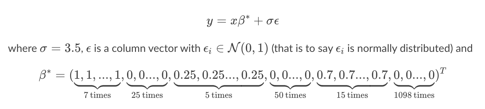

# Comparison of Regularization and Variable Selection Techniques

#### The idea of this project is to compare a variety of different regularization methodologies. The code below will allow us to test SCAD, SQRTLasso with a grid search implementation along with Ridge, Lasso, and ElasticNet. Lasso and Ridge use L1 and L2 regularization respectively. This project will show how well a variety of approaches encorporating these methods perform on 100 generated datasets. Specificially we will measure the Mean Squared Error (MSE), quality of sparsity construction, L2 distance, and Root MSE. 

## Part 1: Creation of SKLearn Compliant Functions - SCAD & Square Root Lasso

### SCAD

```Python
class SCAD(BaseEstimator, RegressorMixin):
    def __init__(self, a=2,lam=1):
        self.a, self.lam = a, lam
  
    def fit(self, x, y):
        a = self.a
        lam = self.lam

        @njit
        def scad_penalty(beta_hat, lambda_val, a_val):
            is_linear = (np.abs(beta_hat) <= lambda_val)
            is_quadratic = np.logical_and(lambda_val < np.abs(beta_hat), np.abs(beta_hat) <= a_val * lambda_val)
            is_constant = (a_val * lambda_val) < np.abs(beta_hat)
            
            linear_part = lambda_val * np.abs(beta_hat) * is_linear
            quadratic_part = (2 * a_val * lambda_val * np.abs(beta_hat) - beta_hat**2 - lambda_val**2) / (2 * (a_val - 1)) * is_quadratic
            constant_part = (lambda_val**2 * (a_val + 1)) / 2 * is_constant
            return linear_part + quadratic_part + constant_part

        @njit    
        def scad_derivative(beta_hat, lambda_val, a_val):
            return lambda_val * ((beta_hat <= lambda_val) + (a_val * lambda_val - beta_hat)*((a_val * lambda_val - beta_hat) > 0) / ((a_val - 1) * lambda_val) * (beta_hat > lambda_val))

        @njit
        def scad(beta):
          beta = beta.flatten()
          beta = beta.reshape(-1,1)
          n = len(y)
          return 1/n*np.sum((y-x.dot(beta))**2) + np.sum(scad_penalty(beta,lam,a))

        @njit  
        def dscad(beta):
          beta = beta.flatten()
          beta = beta.reshape(-1,1)
          n = len(y)
          output = -2/n*np.transpose(x).dot(y-x.dot(beta))+scad_derivative(beta,lam,a)
          return output.flatten()
        
        
        beta0 = np.zeros(p)
        output = minimize(scad, beta0, method='L-BFGS-B', jac=dscad,options={'gtol': 1e-8, 'maxiter': 50000,'maxls': 50,'disp': False})
        beta = output.x
        self.coef_ = beta
        
    def predict(self, x):
        return x.dot(self.coef_)
```
---
## SQRTLasso

```Python
class SQRTLasso(BaseEstimator, RegressorMixin):
    def __init__(self, alpha=0.01):
        self.alpha = alpha
  
    def fit(self, x, y):
        alpha=self.alpha
        @njit
        def f_obj(x,y,beta,alpha):
          n =len(x)
          beta = beta.flatten()
          beta = beta.reshape(-1,1)
          output = np.sqrt(1/n*np.sum((y-x.dot(beta))**2)) + alpha*np.sum(np.abs(beta))
          return output
        @njit
        def f_grad(x,y,beta,alpha):
          n=x.shape[0]
          p=x.shape[1]
          beta = beta.flatten()
          beta = beta.reshape(-1,1)
          output = (-1/np.sqrt(n))*np.transpose(x).dot(y-x.dot(beta))/np.sqrt(np.sum((y-x.dot(beta))**2))+alpha*np.sign(beta)
          return output.flatten()
        
        def objective(beta):
          return(f_obj(x,y,beta,alpha))
        
        def gradient(beta):
          return(f_grad(x,y,beta,alpha))
        
        beta0 = np.ones((x.shape[1],1))
        output = minimize(objective, beta0, method='L-BFGS-B', jac=gradient,options={'gtol': 1e-8, 'maxiter': 50000,'maxls': 25,'disp': True})
        beta = output.x
        self.coef_ = beta
        
    def predict(self, x):
        return x.dot(self.coef_)
```
---

## Part 2: Data Generation of 100 Datasets

The following code gives us two lists, hundred_X and hundred_y. Each of these contain 100 lists, that each have a generated toeplitz correlation structure between the features of 0.8. The features have a functional relationship defined below. 



My code first defines the process to make correlated features, then performs a loop to repeatedly generate these independent and dependent variables while adding them to their respective lists. Ultimately, there are 27 important features that the variable selection methods will have to attempt to deduce.  

```Python
np.random.seed(410)
# we want to define a function for generating X with a prescribed number of obsvervations, features and Toeplitz correlation structure.
def make_correlated_features(num_samples,p,rho):
    vcor = [] 
    for i in range(p):
        vcor.append(rho**i)
    r = toeplitz(vcor)
    mu = np.repeat(0,p)
    X = np.random.multivariate_normal(mu, r, size=num_samples)
    return X

hundred_X = []
hundred_y = []
for iter in range(100):
    n = 200
    p = 1200
    X = make_correlated_features(n,p,0.8)
    hundred_X.append(X)

    beta = np.concatenate(( ([1]*7), ([0]*25), ([0.25]*5), ([0]*50), ([0.7]*15), ([0]*1098) ))
    beta = beta.reshape(-1,1)
    betas = np.concatenate([beta,np.repeat(0,p-len(beta)).reshape(-1,1)],axis=0)
    sigma = 3.5
    y = X.dot(betas) + sigma*np.random.normal(0,1,n).reshape(-1,1)
    hundred_y.append(y)

beta_star = np.concatenate(( ([1]*7), ([0]*25), ([0.25]*5), ([0]*50), ([0.7]*15), ([0]*1098) ))
```
---

Also, definition of soft thresholding since not all regularization techniques reduce unimportant features to 0 we must provide a way to categorize near zero terms as zero.

```Python
def soft_threshold(data, value):
    coef = []
    for i in range(len(data)):
        if data[i] == 0:
            coef.append(0)
        else:
            coef.append(data[i]/np.abs(data[i]) * np.maximum(np.abs(data[i]) - value, 0))
    return np.array(coef)
```

---

## Part 3: Variable Selection Techniques

## Lasso

```Python
model = Lasso(max_iter=5000, fit_intercept=False)
params = [{'alpha':np.linspace(0.001,1,num=20)}]
gs = GridSearchCV(estimator=model,cv=5,scoring='neg_mean_squared_error',param_grid=params)
gs_results = gs.fit(X,y)
print('Grid Search Results:')
print('Best Parameters: ', gs_results.best_params_)
print('The MSE is: ', np.abs(gs_results.best_score_))


sparsity_count_list = []
l2_count_list = []
root_mse_list = []

for indx in range(len(hundred_X)):
    best_alpha = gs_results.best_params_['alpha']
    model = Ridge(alpha=best_alpha)
    model.fit(X,y)

    b_est = soft_threshold(model.coef_[0], best_alpha)
    sparsity_count_list.append(len(np.where(b_est != 0)[0]))
    l2_count_list.append(np.linalg.norm(b_est - beta_star, ord = 2))
    root_mse_list.append(MSE(hundred_y[indx], model.predict(hundred_X[indx]), squared=False))

print('-'*20)
print('Estimator Results:')
print('Average sparsity count: ', np.mean(sparsity_count_list))
print('Average l2 distnace: ', np.mean(l2_count_list))
print('The root mean square error is: ', np.mean(root_mse_list))
```

### Grid Search Results:

Best Parameters:  {'alpha': 0.4216315789473684}

The MSE is:  16.412540259804068

### Estimator Results:

Average sparsity count:  14.0

Average l2 distnace:  3.238324761126144

The root mean square error is:  5.041864952929684

---

## Ridge

```Python
model = Ridge(max_iter=5000, fit_intercept=False)
params = [{'alpha':np.linspace(0.001,1,num=20)}]
gs = GridSearchCV(estimator=model,cv=5,scoring='neg_mean_squared_error',param_grid=params)
gs_results = gs.fit(X,y)
print('Grid Search Results:')
print('Best Parameters: ', gs_results.best_params_)
print('The MSE is: ', np.abs(gs_results.best_score_))


sparsity_count_list = []
l2_count_list = []
root_mse_list = []

for indx in range(len(hundred_X)):
    best_alpha = gs_results.best_params_['alpha']
    model = Ridge(alpha=best_alpha)
    model.fit(X,y)

    b_est = soft_threshold(model.coef_[0], best_alpha)
    sparsity_count_list.append(len(np.where(b_est != 0)[0]))
    l2_count_list.append(np.linalg.norm(b_est - beta_star, ord = 2))
    root_mse_list.append(MSE(hundred_y[indx], model.predict(hundred_X[indx]), squared=False))

print('-'*20)
print('Estimator Results:')
print('Average sparsity count: ', np.mean(sparsity_count_list))
print('Average l2 distnace: ', np.mean(l2_count_list))
print('The root mean square error is: ', np.mean(root_mse_list))
```

### Grid Search Results:

Best Parameters:  {'alpha': 0.001}

The MSE is:  36.58125638249516

### Estimator Results:

Average sparsity count:  1189.0

Average l2 distnace:  2.972838290512862

The root mean square error is:  5.041815206464384

---

## Elastic Net

```Python
model = ElasticNet(max_iter=5000, fit_intercept=False)
params = [{'alpha':np.linspace(0.001,1,num=20),'l1_ratio':np.linspace(0.1,1,num=20)}]
gs = GridSearchCV(estimator=model,cv=5,scoring='neg_mean_squared_error',param_grid=params)
gs_results = gs.fit(X,y)
print('Grid Search Results:')
print('Best Parameters: ', gs_results.best_params_)
print('The MSE is: ', np.abs(gs_results.best_score_))


sparsity_count_list = []
l2_count_list = []
root_mse_list = []

for indx in range(len(hundred_X)):
    best_alpha = gs_results.best_params_['alpha']
    best_l1_ratio = gs_results.best_params_['l1_ratio']
    model = ElasticNet(alpha=best_alpha, l1_ratio=best_l1_ratio)
    model.fit(X,y)

    b_est = soft_threshold(model.coef_, best_alpha*best_l1_ratio)
    sparsity_count_list.append(len(np.where(b_est != 0)[0]))
    l2_count_list.append(np.linalg.norm(b_est - beta_star, ord = 2))
    root_mse_list.append(MSE(hundred_y[indx], model.predict(hundred_X[indx]), squared=False))

print('-'*20)
print('Estimator Results:')
print('Average sparsity count: ', np.mean(sparsity_count_list))
print('Average l2 distnace: ', np.mean(l2_count_list))
print('The root mean square error is: ', np.mean(root_mse_list))
```

### Grid Search Results:

Best Parameters:  {'alpha': 0.5106938775510205, 'l1_ratio': 0.7428571428571429}

The MSE is:  15.613961705007238

### Estimator Results:

Average sparsity count:  20.0

Average l2 distnace:  2.623354847498193

The root mean square error is:  3.767607799460272

---

## SCAD

```Python
model = SCAD()
params = [{'a':np.linspace(0.01,1,num=5),'lam':np.linspace(0.1,2,num=5)}]
gs = GridSearchCV(estimator=model,cv=5,scoring='neg_mean_squared_error',param_grid=params)
gs_results = gs.fit(X,y)
print('Grid Search Results:')
print('Best Parameters: ', gs_results.best_params_)
print('The MSE is: ', np.abs(gs_results.best_score_))


sparsity_count_list = []
l2_count_list = []
root_mse_list = []

for indx in range(len(hundred_X)):
    best_alpha = gs_results.best_params_['a']
    best_lam = gs_results.best_params_['lam']
    model = SCAD(a=best_alpha, lam=best_lam)
    model.fit(X,y)

    b_est = soft_threshold(model.coef_, best_alpha*best_lam)
    sparsity_count_list.append(len(np.where(b_est != 0)[0]))
    l2_count_list.append(np.linalg.norm(b_est - beta_star, ord = 2))
    root_mse_list.append(MSE(hundred_y[indx], model.predict(hundred_X[indx]), squared=False))

print('-'*20)
print('Estimator Results:')
print('Average sparsity count: ', np.mean(sparsity_count_list))
print('Average l2 distnace: ', np.mean(l2_count_list))
print('The root mean square error is: ', np.mean(root_mse_list))
```

### Grid Search Results:

Best Parameters:  {'a': 0.505, 'lam': 0.1}

The MSE is:  39.07659495786903

### Estimator Results:

Average sparsity count:  637.0

Average l2 distnace:  2.324700199732335

The root mean square error is:  5.556636736418437

---

## SQRTLasso

```Python
model = SQRTLasso()
params = [{'alpha':np.linspace(0.001,1,num=20)}]
gs = GridSearchCV(estimator=model,cv=5,scoring='neg_mean_squared_error',param_grid=params)
gs_results = gs.fit(X,y)
print('Grid Search Results:')
print('Best Parameters: ', gs_results.best_params_)
print('The MSE is: ', np.abs(gs_results.best_score_))


sparsity_count_list = []
l2_count_list = []
root_mse_list = []

for indx in range(len(hundred_X)):
    best_alpha = gs_results.best_params_['alpha']
    model = SQRTLasso(alpha=best_alpha)
    model.fit(X,y)

    b_est = soft_threshold(model.coef_, best_alpha)
    sparsity_count_list.append(len(np.where(b_est != 0)[0]))
    l2_count_list.append(np.linalg.norm(b_est - beta_star, ord = 2))
    root_mse_list.append(MSE(hundred_y[indx], model.predict(hundred_X[indx]), squared=False))

print('-'*20)
print('Estimator Results:')
print('Average sparsity count: ', np.mean(sparsity_count_list))
print('Average l2 distnace: ', np.mean(l2_count_list))
print('The root mean square error is: ', np.mean(root_mse_list))
```

### Grid Search Results:

Best Parameters:  {'alpha': 0.15873684210526315}

The MSE is:  14.74117758313055

### Estimator Results:

Average sparsity count:  23.0

Average l2 distnace:  1.737348761040297

The root mean square error is:  3.7235592276616827

---

## Conclusions

The table below shows how each of the tested methods compare quantitatively on our generated dataset. The values have been rounded to 2 decimal places for ease of comparison.

| Model | MSE | Avg Sparsity Count | Avg L2 Distance | Root MSE
| --- | --- | --- | --- | --- |
| Lasso | 16.41 | 14.0 | 3.24 | 5.04 |
| Ridge | 36.58 | 1189.0 | 2.97 | 5.04 |
| Elastic Net | 15.61 | 20.0 | 2.62 | 3.77 |
| SCAD | 39.08 | 637.0 | 2.32 | 5.56 |
| SQRTLasso | 14.74 | 23.0 | 1.74 | 3.72 |

The final results show that the SQRTLasso method is superior in MSE, Sparsity values, L2 distance, and Root MSE. Incredibly, it outperfomed all other methods in all areas measured. It also averaged very closely to the correct sparsity number. Our test datasets has 27 important features, and SQRTLasso averaged 23. This is followed most closely to Elastic Net with 20 features, which combines both L1 and L2 regularization.

Ultimately, the winner for this project is SQRTLasso.

### Resources

<https://www.kaggle.com/residentmario/soft-thresholding-with-lasso-regression>

<https://eeweb.engineering.nyu.edu/iselesni/lecture_notes/SoftThresholding.pdf>