# Malicious Phish

My research goal is to find an effective method of classifying URLs into categories of benign, defacement, phishing, and malware. I will be expanding on current research by exploring the effectiveness of Random Forest, Adaboost, XGBoost, and LightGBM. Finally in the latter stages I will discuss the benefits of implementing an Adaptive Synthetic (ADASYN) algorithm on the imbalanced dataset.

<!-- ## Setup
I used the following libraries to perform my research, I am listing them here for ease of replication of my results.
```Python
import re
import copy
import numpy as np
import pandas as pd
import seaborn as sea
import seaborn as sns
import lightgbm as lgb
from tld import get_tld
from typing import Tuple
from statistics import mean
from sklearn import metrics
import matplotlib.pyplot as plt
from xgboost import XGBClassifier
from sklearn import preprocessing
from mpl_toolkits.mplot3d import Axes3D
from IPython.display import clear_output
from sklearn.model_selection import KFold
from imblearn.over_sampling import ADASYN
from sklearn.metrics import accuracy_score
from sklearn.ensemble import AdaBoostClassifier
from sklearn.tree import DecisionTreeClassifier
from sklearn.preprocessing import StandardScaler
from sklearn.ensemble import RandomForestClassifier
from sklearn.metrics import mean_squared_error as MSE
from sklearn.metrics import mean_absolute_error as MAE
from sklearn.ensemble import GradientBoostingClassifier
from sklearn.neighbors import KNeighborsClassifier as KNN
from sklearn.model_selection import train_test_split as tts
from sklearn.model_selection import GridSearchCV, RandomizedSearchCV
from sklearn.metrics import confusion_matrix, classification_report, accuracy_score
``` -->
## Data Pre-Processing
The dataset is from Kaggle, and can be found at <https://www.kaggle.com/datasets/sid321axn/malicious-urls-dataset>

```Python
data = pd.read_csv('/content/drive/MyDrive/ML_410/FinalProject/malicious_phish.csv'

count = data.type.value_counts()
sea.barplot(x=count.index, y=count)
plt.xlabel('Types')
plt.ylabel('Count');
```

This allows us to see number of samples we have in each category. Notice that this dataset is primarily comprised of benign URLs. 

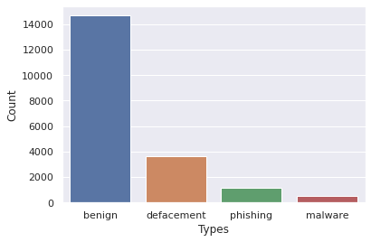

The next step is to change the categories into numerical values. I will assign 0 to benign, 1 to defacement, 2 to phishing, and 3 to malware.

```Python
data['url'] = data['url'].replace('www.', '', regex=True)
# convert categories of url to numberical values
categories = {"category": {"benign": 0, "defacement": 1, "phishing":2, "malware":3}}
data['category'] = data['type']
data = data.replace(categories)
```

## Feature Extraction

We now have a dataset that contains the URLs and their classifications, but we need to have features to train our models on. Instead of taking a natural language processing approach, I would like to approach this situation by extracting more data out of each sample in the form of quantities. 

This code takes count of the number of each special character in every URL. 

```Python
data['urlLen'] = data['url'].apply(lambda x: len(str(x)))
feature = ['.', '~','!','@','#','$','%','&','*','-','+','=',',','/','//','\\', 'https:']
for a in feature:
    data[a] = data['url'].apply(lambda i: i.count(a))
```

I would like to extract the number digits in each URL. 

```Python
def digit_count(url):
    digits = 0
    for i in url:
        if i.isnumeric():
            digits += 1
    return digits

data['digits']= data['url'].apply(lambda i: digit_count(i))
```

Next, I would like to extract the number of letters in each URL. 

```Python
def letter_count(url):
    letters = 0
    for i in url:
        if i.isalpha():
            letters = letters + 1
    return letters

data['letters']= data['url'].apply(lambda i: letter_count(i))
```

Next, I would like to determine whether a URL uses a shortening service. I'll use regex to do so.

```Python
def Shortining_Service(url):
    match = re.search('bit\.ly|goo\.gl|shorte\.st|go2l\.ink|x\.co|ow\.ly|t\.co|tinyurl|tr\.im|is\.gd|cli\.gs|'
                      'yfrog\.com|migre\.me|ff\.im|tiny\.cc|url4\.eu|twit\.ac|su\.pr|twurl\.nl|snipurl\.com|'
                      'short\.to|BudURL\.com|ping\.fm|post\.ly|Just\.as|bkite\.com|snipr\.com|fic\.kr|loopt\.us|'
                      'doiop\.com|short\.ie|kl\.am|wp\.me|rubyurl\.com|om\.ly|to\.ly|bit\.do|t\.co|lnkd\.in|'
                      'db\.tt|qr\.ae|adf\.ly|goo\.gl|bitly\.com|cur\.lv|tinyurl\.com|ow\.ly|bit\.ly|ity\.im|'
                      'q\.gs|is\.gd|po\.st|bc\.vc|twitthis\.com|u\.to|j\.mp|buzurl\.com|cutt\.us|u\.bb|yourls\.org|'
                      'x\.co|prettylinkpro\.com|scrnch\.me|filoops\.info|vzturl\.com|qr\.net|1url\.com|tweez\.me|v\.gd|'
                      'tr\.im|link\.zip\.net', url)
    if match:
        return 1
    else:
        return 0

data['shortservice'] = data['url'].apply(lambda x: Shortining_Service(x))
```

... Or if it contains an ip address rather than a standard domain, using regex to find these patterns.

```Python
def having_ip_address(url):
    # check for IPv4 Address, then IPv4 with port number, then IPv4 in hex, and finally IPv6
    match = re.search(
        '(([01]?\\d\\d?|2[0-4]\\d|25[0-5])\\.([01]?\\d\\d?|2[0-4]\\d|25[0-5])\\.([01]?\\d\\d?|2[0-4]\\d|25[0-5])\\.'
        '([01]?\\d\\d?|2[0-4]\\d|25[0-5])\\/)|'
        '(([01]?\\d\\d?|2[0-4]\\d|25[0-5])\\.([01]?\\d\\d?|2[0-4]\\d|25[0-5])\\.([01]?\\d\\d?|2[0-4]\\d|25[0-5])\\.'
        '([01]?\\d\\d?|2[0-4]\\d|25[0-5])\\/)|'
        '((0x[0-9a-fA-F]{1,2})\\.(0x[0-9a-fA-F]{1,2})\\.(0x[0-9a-fA-F]{1,2})\\.(0x[0-9a-fA-F]{1,2})\\/)'
        '(?:[a-fA-F0-9]{1,4}:){7}[a-fA-F0-9]{1,4}|'
        '([0-9]+(?:\.[0-9]+){3}:[0-9]+)|'
        '((?:(?:\d|[01]?\d\d|2[0-4]\d|25[0-5])\.){3}(?:25[0-5]|2[0-4]\d|[01]?\d\d|\d)(?:\/\d{1,2})?)', url)
    if match:
        return 1
    else:
        return 0

data['ipaddress'] = data['url'].apply(lambda x: having_ip_address(x))
```

Next I'll check if the link is in ascii format or if it contains really unique characters.

```Python
def asciiCheck(url):
    if url.isascii():
        return 0
    return 1

data['isntAscii']= data['url'].apply(lambda i: asciiCheck(i))
```

I also want to know what the ratio of capital to lowercase letters is.

```Python
def capitalToLowerRatio(url):
    upper = sum(1 for c in url if c.isupper())
    lower = sum(1 for c in url if c.islower())
    return upper/lower

data['capitalToLower']= data['url'].apply(lambda i: capitalToLowerRatio(i))
```

Next I'll use the TLD package to get the top level domain and see if it's a relatively common one.

```Python
def nonstandardTLD(url):
    try:
        topleveldomain = get_tld(url)
        if topleveldomain in ['com', 'org', 'net', 'int', 'edu', 'gov', 'mil']:
            return 0
        else:
            return 1
    except:
        return 1

data['nonStandardTLD']= data['url'].apply(lambda i: nonstandardTLD(i))
```

Finally, as a sort of creative thought, I'll see how long the biggest repeating subsequence is.

```Python
def findLongestRepeatingSubSeq(str):
 
    n = len(str)
    # Create and initialize DP table
    dp=[[0 for i in range(n+1)] for j in range(n+1)]
    # Fill dp table (similar to LCS loops)
    for i in range(1,n+1):
        for j in range(1,n+1):
            # If characters match and indexes are not same
            if (str[i-1] == str[j-1] and i != j):
                dp[i][j] = 1 + dp[i-1][j-1]                
            # If characters do not match
            else:
                dp[i][j] = max(dp[i][j-1], dp[i-1][j])
    return dp[n][n]

data['maxrepeatedsubstring']= data['url'].apply(lambda i: findLongestRepeatingSubSeq(i))
```

With all of the above steps performed, we now have 26 data points that we extracted from each URL!

Finally, we will prep our data to be used in some machine learning algorithms!

```Python
X = data.drop(['url','type','category'],axis=1)
y = data['category']
```

## Data Exploration
Before we begin feeding the data into the models, I'd like to take a second to better understand our features. While it won't be possible to be model past the 3rd dimension, just a slight bit of visualization always helps me.

First I'll transform the data to be normalized
```Python
transformed_data = scale.fit_transform(X[:][['urlLen', 'capitalToLower', '.']])
transformed_data = preprocessing.normalize(transformed_data)
transformed_data
```

Then I would like to assign colors to the types of categories.
- Blue: Benign
- Orange: Defacement
- Green: Phishing
- Pink: Malware

```Python
colors = ['#469fe3' if v == 0 else '#ef8a62' if v == 1 else '#54d177' if v == 2 else '#ff00f7' for v in y]
kwarg_params = {'linewidth': 0.3, 'edgecolor': 'black'}
plt.figure(figsize=(14,10))
plt.scatter(transformed_data[:, 0], transformed_data[:, 1], c=colors, **kwarg_params)
plt.xlabel("urlLen")
plt.ylabel("capitalToLower")
sns.despine()
plt.suptitle("Benchmark Data")
```

This visualization shows the URL length and Capital to Lowercase letter ratios.

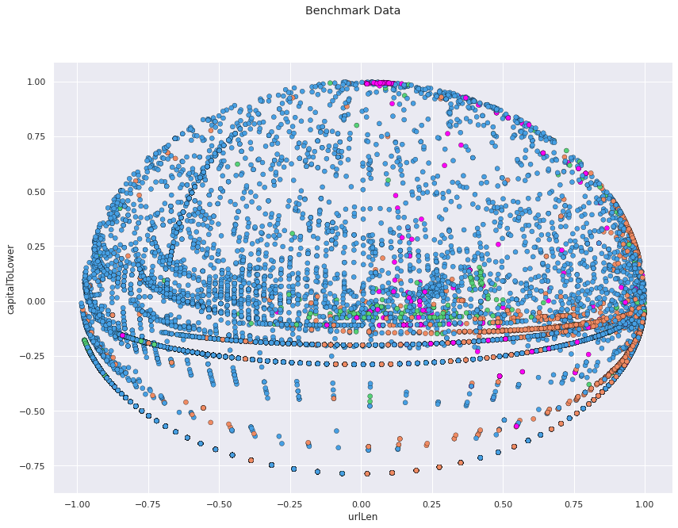

Additionally, I think it could be helpful to expand this visualizing to also include another datapoint beyong just URL length and Capital to Lowercase ratio, so lets add a count of periods '.' in the URL. 

```Python
sns.set(style = "darkgrid")

fig = plt.figure(figsize=(10, 8), dpi=100)
ax = fig.add_subplot(111, projection = '3d')

ax.set_xlabel("urlLen")
ax.set_ylabel("capitalToLower")
ax.set_zlabel(".")

kwarg_params = {'linewidth': 0.2, 'edgecolor': 'black'}
colors = ['#469fe3' if v == 0 else '#ef8a62' if v == 1 else '#54d177' if v == 2 else '#ff00f7' for v in y]
ax.scatter(transformed_data[:, 0], transformed_data[:, 1], transformed_data[:, 2],  cmap = 'coolwarm', c=colors, **kwarg_params)
plt.suptitle("Benchmark Data")
plt.show()
```

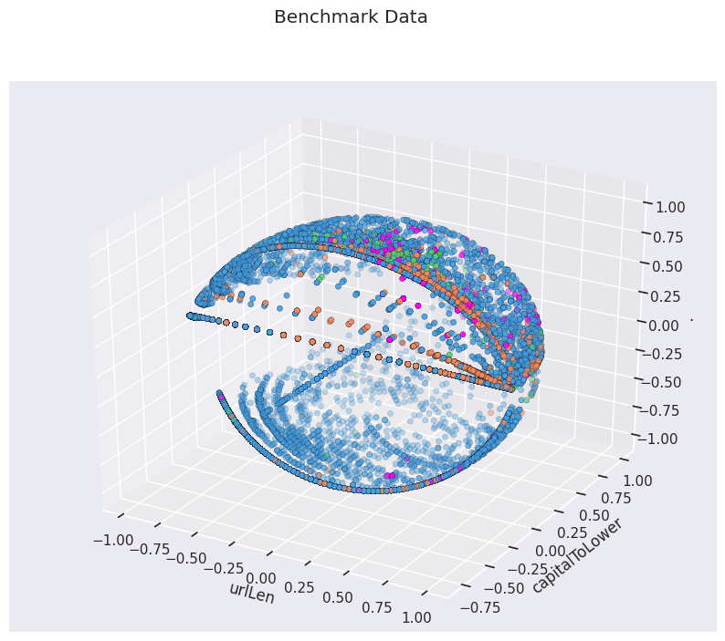

This 3D plot now shows the three variables, colorcoded the same as before. It also starts to show the complexity of categorizing URLs. To me, there appears to be noticible (but hardly absolute) regions that distinguish classifications. 


## Quick Rough Comparison of Algorithms

### Model: Decision Tree
```Python
random_search = RandomizedSearchCV(DecisionTreeClassifier(random_state=0),
                           {
                            'max_depth':np.arange(1,50,2),
                            'criterion':['gini', 'entropy'],
                            'splitter':['best', 'random'],
                            'min_samples_split':np.arange(2, 5, 1),
                            'min_samples_leaf':np.arange(1, 5, 1)
                            },cv=5, scoring="balanced_accuracy",verbose=1,n_jobs=-1, 
                             n_iter=40, random_state = 0
                           )
random_search.fit(X,y)
print(random_search.best_score_, random_search.best_params_)
print(random_search.best_estimator_)
```
Score: 0.845
Model: DecisionTreeClassifier(max_depth=31, min_samples_split=3)

### Model: Random Forest
```Python
random_search = RandomizedSearchCV(RandomForestClassifier(random_state=0, objective='multiclass'),
                           {
                              'n_estimators':np.arange(80,160,5),
                              'max_depth':np.arange(1,50,2),
                               'min_samples_split':np.arange(2, 5, 1)
                            },cv=3, scoring="balanced_accuracy",verbose=1,n_jobs=-1, 
                             n_iter=25, random_state = 0
                           )
random_search.fit(X,y)
print(random_search.best_score_, random_search.best_params_)
print(random_search.best_estimator_)
```
Score: 0.856
Model: RandomForestClassifier(max_depth=41, min_samples_split=3)

### Model: Gradient Boosting
```Python
random_search = RandomizedSearchCV(GradientBoostingClassifier(random_state=0),
                           {
                              'n_estimators':np.arange(30,140,5)
                            },cv=3, scoring="balanced_accuracy",verbose=1,n_jobs=-1, 
                             n_iter=20, random_state = 0
                           )
random_search.fit(X,y)
print(random_search.best_score_, random_search.best_params_)
print(random_search.best_estimator_)
```
Score: 0.861
Model: GradientBoostingClassifier(n_estimators=115)

### Model: K-Nearest Neighbors
```Python
random_search = RandomizedSearchCV(KNN(),
                           {
                            'n_neighbors':np.arange(2,22,2),
                            'weights':['uniform', 'distance'],
                            'leaf_size':np.arange(5,60, 5),
                            'algorithm':['ball_tree','kd_tree', 'brute']
                            },cv=3, scoring="balanced_accuracy",verbose=1,n_jobs=-1, 
                             n_iter=40, random_state = 0
                           )
random_search.fit(X,y)
print(random_search.best_score_, random_search.best_params_)
print(random_search.best_estimator_)
```
Score: 0.714
Model: KNeighborsClassifier(algorithm='kd_tree', leaf_size=50, n_neighbors=2,
                     weights='distance')

### Model: AdaBoost
```Python
random_search = RandomizedSearchCV(AdaBoostClassifier(random_state=0),
                           {
                              'n_estimators':np.arange(30,150,2)
                            },cv=3, scoring="balanced_accuracy",verbose=1,n_jobs=-1, 
                             n_iter=30, random_state = 0
                           )
random_search.fit(X,y)
print(random_search.best_score_, random_search.best_params_)
print(random_search.best_estimator_)
```
Score: 0.608
Model: AdaBoostClassifier(n_estimators=110)

### Model: XGBoost Classifier
```Python
random_search = RandomizedSearchCV(XGBClassifier(random_state=0, objective='multiclass'),
                           {
                            'n_estimators':np.arange(30,140,5),
                            'learning_rate':[0.2, 0.3, 0.5, 0.8, 1],
                            'gamma':np.arange(0, 10, 1),
                            'max_depth':np.arange(4,16,2),
                            'max_delta_step':np.arange(0, 5, 1)
                            },cv=3, scoring="balanced_accuracy",verbose=1,n_jobs=-1, 
                             n_iter=50, random_state = 0
                           )
random_search.fit(X,y)
print(random_search.best_score_, random_search.best_params_)
print(random_search.best_estimator_)
```
Score: 0.862
Model: XGBClassifier(learning_rate=0.5, max_delta_step=4, max_depth=6, n_estimators=35,
              objective='multi:softprob')

### Model: LGBM Classifier
```Python
random_search = RandomizedSearchCV(lgb.LGBMClassifier(random_state=0, objective='multiclass', num_class=4),
                           {
                            'n_estimators':np.arange(50,200,2),
                            'max_bin':np.arange(50,600, 25),
                            'learning_rate':np.arange(0.1, 0.9, 0.1),
                            'num_leaves':np.arange(10, 60, 5)
                            },cv=3, scoring="balanced_accuracy",verbose=1,n_jobs=-1, 
                             n_iter=20, random_state = 0
                           )
random_search.fit(X,y)
print(random_search.best_score_, random_search.best_params_)
print(random_search.best_estimator_)
```
Score; 0.862
Model: LGBMClassifier(learning_rate=0.6, max_bin=75, n_estimators=192, num_class=4, num_leaves=40, objective='multiclass')

### Results from Testing

| Model | Mean Cross-Validated Score 
| --- | --- |
| Decision Tree | 0.845 |
| Random Forest | 0.856 |
| KNN | 0.714 |
| Gradient Boosting | 0.861 |
| AdaBoost | 0.608 |
| XGBoost | 0.862 |
| LGBM | 0.862 |


Given these results, I would like to further explore the potential of Random Forest, Adaboost, LGBM, and XGBoost.

## Analyzing Model Performence 

To better understand which of the above models has the best potential for real world application, I want to cross validate the results further and obtain more information.

- Accuracy Scores
- Sensitivity Scores
- Specificity Scores
- Micro F1 Scores
- Mactro F1 Scores

The following chunk of code is a reusable way to gather all this information from each model.


```Python
def cross_val_predict(model, kfold : KFold, X : np.array, y : np.array) -> Tuple[np.array, np.array, np.array]:
    accscoreslist = []
    sensitivitylist = []
    specificitylist = []
    f1microlist = []
    f1macrolist = []
    model_ = copy.deepcopy(model)
    no_classes = len(np.unique(y))
    
    actual_classes = np.empty([0], dtype=int)
    predicted_classes = np.empty([0], dtype=int)
    predicted_proba = np.empty([0, no_classes]) 

    for train_ndx, test_ndx in kfold.split(X):

        train_X, train_y, test_X, test_y = X[train_ndx], y[train_ndx], X[test_ndx], y[test_ndx]

        model_.fit(train_X, train_y)
        actual_classes = np.append(actual_classes, test_y)
        predicted_classes = np.append(predicted_classes, model_.predict(test_X))
        
        accscoreslist.append(accuracy_score(predicted_classes, actual_classes))

        confusion = metrics.confusion_matrix(actual_classes, predicted_classes)
        TP = confusion[1, 1]
        TN = confusion[0, 0]
        FP = confusion[0, 1]
        FN = confusion[1, 0]
        
        sensitivity = TP / float(FN + TP)
        sensitivitylist.append(sensitivity)

        specificity = TN / (TN + FP)
        specificitylist.append(specificity)

        f1micro = metrics.f1_score(actual_classes, predicted_classes, average='micro')
        f1microlist.append(f1micro)
        
        f1macro = metrics.f1_score(actual_classes, predicted_classes, average='macro')
        f1macrolist.append(f1macro)

        try:
            predicted_proba = np.append(predicted_proba, model_.predict_proba(test_X), axis=0)
        except:
            predicted_proba = np.append(predicted_proba, np.zeros((len(test_X), no_classes), dtype=float), axis=0)

    return actual_classes, predicted_classes, predicted_proba, mean(accscoreslist), mean(sensitivitylist), mean(specificitylist), mean(f1microlist), mean(f1macrolist)

def plot_confusion_matrix(actual_classes : np.array, predicted_classes : np.array, sorted_labels : list, namemodel : str):

    matrix = confusion_matrix(actual_classes, predicted_classes, labels=sorted_labels)
    
    plt.figure(figsize=(12.8,6))
    mylabels = ['Benign', 'Defacement', 'Phishing', 'Malware']
    sns.heatmap(matrix, annot=True, xticklabels=mylabels, yticklabels=mylabels, fmt="g", center=1)
    plt.xlabel('Predicted'); plt.ylabel('Actual'); plt.title(namemodel)

    plt.show()
```

This code runs the above functions while switching out each model.

```Python
kfold = KFold(n_splits=5, random_state=0, shuffle=True)

# New Model
print('---- Model: Adaboost ---- ')
model = AdaBoostClassifier(n_estimators=110, random_state=0)
actual_classes, predicted_classes, predicted_proba, avgacc, avgsensitivity, avgspecificity, avgf1micro, avgf1macro = cross_val_predict(model, kfold, X.to_numpy(), y.to_numpy())
plot_confusion_matrix(actual_classes, predicted_classes, [0, 1, 2, 3], "Confusion Matrix - Adaboost")
print('Avg Cross-Val Accuracy:', round(avgacc*100, 2), '%')
print('Avg Cross-Val Sensitivity:', round(avgsensitivity, 3))
print('Avg Cross-Val Specificity:', round(avgspecificity, 3))
print('Avg Cross-Val MicroF1:', round(avgf1micro, 2))
print('Avg Cross-Val MacroF1:', round(avgf1macro, 2))

# New Model
print('---- Model: LGBM ---- ')
model = lgb.LGBMClassifier(learning_rate=0.6, max_bin=75, n_estimators=192, num_class=4, num_leaves=40, objective='multiclass', random_state=0)
actual_classes, predicted_classes, predicted_proba, avgacc, avgsensitivity, avgspecificity, avgf1micro, avgf1macro = cross_val_predict(model, kfold, X.to_numpy(), y.to_numpy())
plot_confusion_matrix(actual_classes, predicted_classes, [0, 1, 2, 3], "Confusion Matrix - LightGBM")
print('Avg Cross-Val Accuracy:', round(avgacc*100, 2), '%')
print('Avg Cross-Val Sensitivity:', round(avgsensitivity, 3))
print('Avg Cross-Val Specificity:', round(avgspecificity, 3))
print('Avg Cross-Val MicroF1:', round(avgf1micro, 2))
print('Avg Cross-Val MacroF1:', round(avgf1macro, 2))

# New Model
print('---- Model: XGBoost ---- ')
model = XGBClassifier(learning_rate=0.5, max_delta_step=4, max_depth=6, n_estimators=35, objective='multi:softprob')
actual_classes, predicted_classes, predicted_proba, avgacc, avgsensitivity, avgspecificity, avgf1micro, avgf1macro = cross_val_predict(model, kfold, X.to_numpy(), y.to_numpy())
plot_confusion_matrix(actual_classes, predicted_classes, [0, 1, 2, 3], "Confusion Matrix - XGBoost")
print('Avg Cross-Val Accuracy:', round(avgacc*100, 2), '%')
print('Avg Cross-Val Sensitivity:', round(avgsensitivity, 3))
print('Avg Cross-Val Specificity:', round(avgspecificity, 3))
print('Avg Cross-Val MicroF1:', round(avgf1micro, 2))
print('Avg Cross-Val MacroF1:', round(avgf1macro, 2))

# New Model
print('---- Model: Random Forest Classifier ---- ')
model = RandomForestClassifier(max_depth=41, min_samples_split=3, random_state=0)
actual_classes, predicted_classes, predicted_proba, avgacc, avgsensitivity, avgspecificity, avgf1micro, avgf1macro = cross_val_predict(model, kfold, X.to_numpy(), y.to_numpy())
plot_confusion_matrix(actual_classes, predicted_classes, [0, 1, 2, 3], "Confusion Matrix - Random Forest Classifier")
print('Avg Cross-Val Accuracy:', round(avgacc*100, 2), '%')
print('Avg Cross-Val Sensitivity:', round(avgsensitivity, 3))
print('Avg Cross-Val Specificity:', round(avgspecificity, 3))
print('Avg Cross-Val MicroF1:', round(avgf1micro, 2))
print('Avg Cross-Val MacroF1:', round(avgf1macro, 2))
```

Here are the four heatmaps from the results. 

AdaBoost             |  LightGBM
:-------------------------:|:-------------------------:
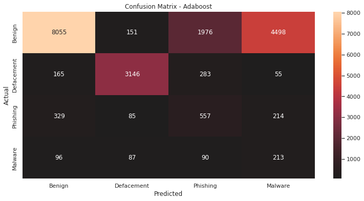  |  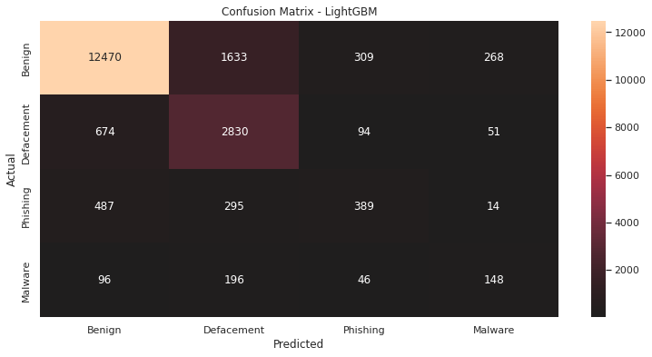

XGBoost             |  Random Forest
:-------------------------:|:-------------------------:
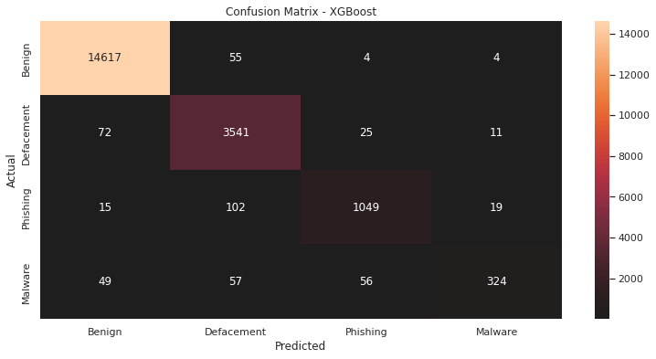  |  


I have summarized the results in tabular form:

| Measurement | AdaBoost | LightGBM | XGBoost | Random Forest
| --- | --- | --- | --- | --- |
| Accuracy | 60.88% | 85.94% | 97.53% | 97.50%|
| Sensitivity | 0.948 | 0.798 | 0.976 | 0.975 |
| Specificity | 0.983 | 0.949 | 0.997| 0.998 |
| Micro F1 | 0.61 | 0.86 | 0.98 | 0.97 |
| Macro F1 | 0.48 | 0.68 | 0.90 | 0.90 |

## Adaptive Synthetic Oversampling (ADASYN)

Since the dataset is completely imbalanced with the majority of observations being benign, it is worth considering crafting a balanced dataset and seeing how the algorithms perform.

ADASYN lets us do this in just a few lines of code!

```Python
ada = ADASYN(random_state=0)
X_resamp, y_resamp = ada.fit_resample(X, y)
transformed_data = scale.fit_transform(X_resamp[:][['urlLen', 'capitalToLower', '.']])
transformed_data = preprocessing.normalize(transformed_data)
```

## Re-Exploring Oversampled Data 

This visualization shows the URL length and Capital to Lowercase letter ratios with our newly resampled data. The 3d version also contains a count of periods '.' in the url.


Given Data            |  Oversampled Data
:-------------------------:|:-------------------------:
  |  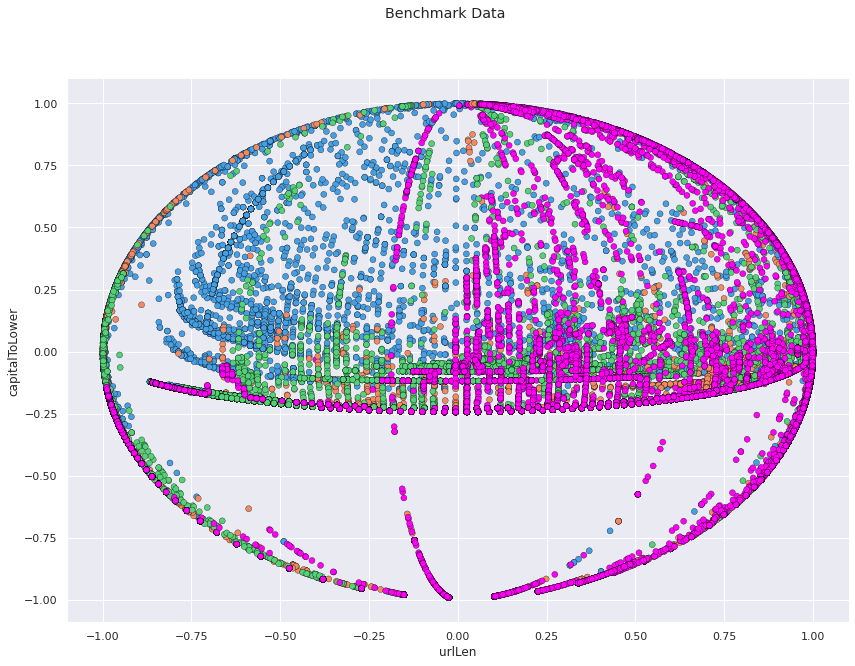

Given Data             |  Oversampled Data
:-------------------------:|:-------------------------:
  |  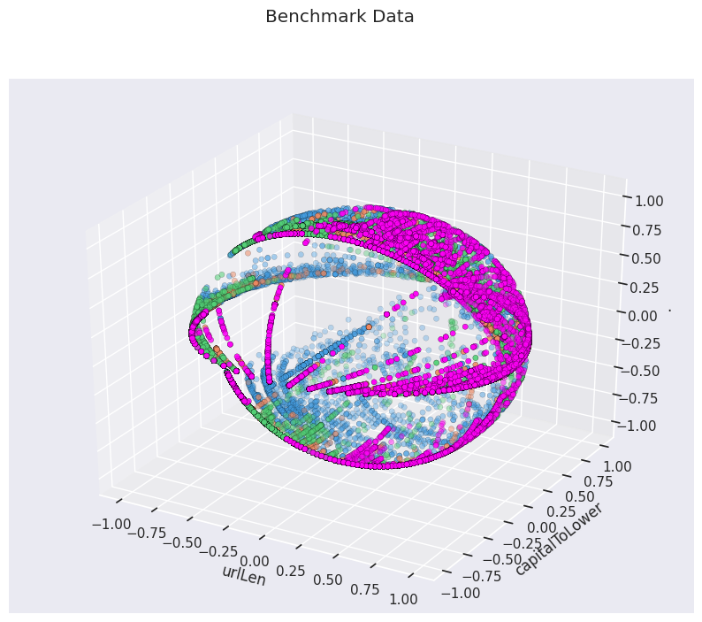

Given Data             |  Oversampled Data
:-------------------------:|:-------------------------:
  |  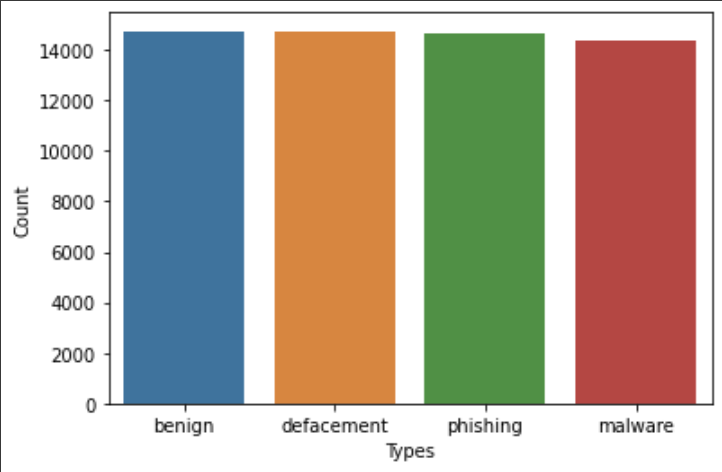

## Rerunning Tests using Oversampled Data

AdaBoost             |  LightGBM
:-------------------------:|:-------------------------:
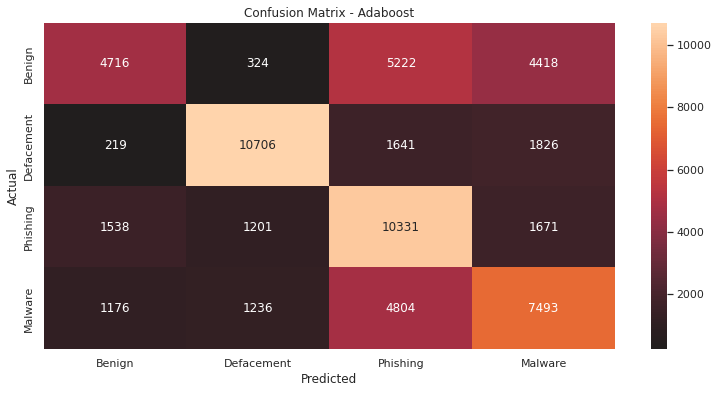  |  

XGBoost             |  Random Forest
:-------------------------:|:-------------------------:
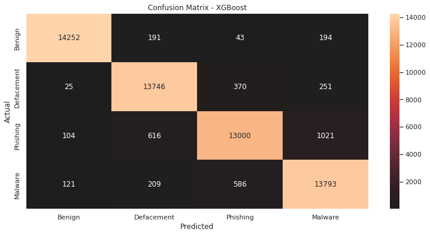  |  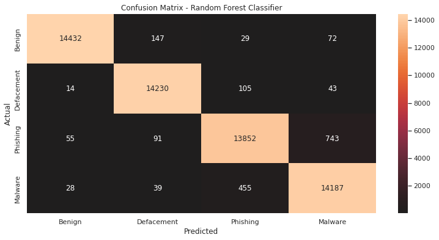


And here are the statistics repors in tabular form:

| Measurement | AdaBoost | LightGBM | XGBoost | Random Forest
| --- | --- | --- | --- | --- |
| Accuracy | 56.70% | 88.87% | 93.55% | 96.84%|
| Sensitivity | 0.982 | 0.974 | 0.998 | 0.999 |
| Specificity | 0.930 | 0.973 | 0.987| 0.990 |
| Micro F1 | 0.57 | 0.89 | 0.94 | 0.97 |
| Macro F1 | 0.56 | 0.89 | 0.94 | 0.97 |

## Conclusion
The need for contextual clues in determining malicious links. For example, a history of malicious services on the link domain show the potential for abuse. These historical data points could be obtained from google transparency report, or resources like URLVoid. Part of the complexity of this classification problem also stems from the dataset. Some links are categoriezed as 'defacement' as they once were, but have since been re-establised as benign websites.

It is also important to consider whether we want to optimize for *precision* or *specificity*. When considering the applications of these models for daily use, it seems that false positives would be preferable to false negatives. In other words, is better that we flag links as concerning that are actually benign than to flag a malicious link as benign and risk compromising security. 

Additional research could explore natural language processing techniques of analyzing the URL data, along with implementations of custom neural networks.

## Sources

https://www.lifewire.com/how-to-test-a-suspicious-link-without-clicking-it-2487171
https://blog.hubspot.com/marketing/check-link-site

https://medium.com/apprentice-journal/evaluating-multi-class-classifiers-12b2946e755b

https://www.ritchieng.com/machine-learning-evaluate-classification-model/

https://towardsdatascience.com/how-to-plot-a-confusion-matrix-from-a-k-fold-cross-validation-b607317e9874

https://www.ritchieng.com/machine-learning-evaluate-classification-model/

https://datascience.stackexchange.com/questions/15989/micro-average-vs-macro-average-performance-in-a-multiclass-classification-settin

