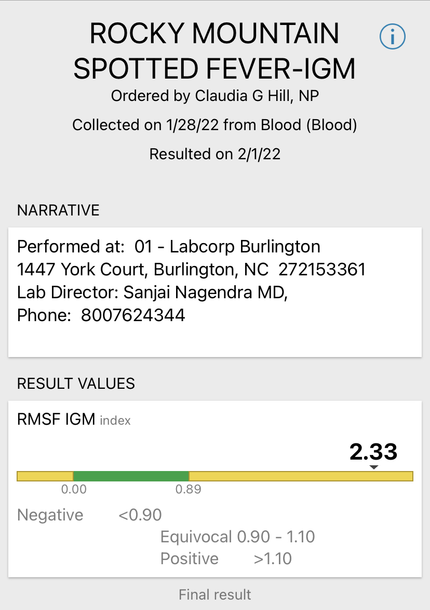

# Advanced Applied Machine Learning

### Personal Note
I contracted Rocky Mountain Spotted Fever (RMSF) from a tick bite on December 28 of 2021 on a trip to North Carolina. Over the next few weeks, my symptoms progressed while I convinced myself I had covid - despite continuing to test negative. On January 28 blood tests showed low white blood cell count and kidney issues. February 1st I tested positive for RMSF with a titer of 2.33 and started on doxycycline. 

The fatality rate is up to 30% in untreated patients. Early antibiotic treatment within 5 days of sickness lowers this to 3-5%. 

I am currently improving, and more thankful than ever for the upcoming semester. 

---

## Cases of Rocky Mountain Spotted Fever in the United States (2014)


## Differential equation 


#### "Ticks can attach at a rate α, detach at a rate θT and die at a rate δT. The production rate ρ of NT is assumed to be proportional to the total number of susceptible and infected attached ticks of the previous generation. Infected adult ticks have a lower production rate ρI than susceptible adult ticks ρS, and the fraction of offspring by infected ticks is given by aS = 305/532 and aI = 228/532".
###### Source: https://journals.plos.org/ploscompbiol/article?id=10.1371/journal.pcbi.1006636

---

## Script to evaluate RMSF blood test

```Python
# Test Rocky Mountain Spotted Fever
# IGM - Blood Test (Immunoglobulins)

def RMSF_IGM(titer_value):
    if titer_value < 0.90:
        print("Negative")
    elif titer_value > 0.90 and titer_value < 1.10:
        print("Equivocal")
    elif titer_value > 1.10:
        print("Positive")
    
my_titer = 2.33
RMSF_IGM(my_titer)
```

My lab result: 

